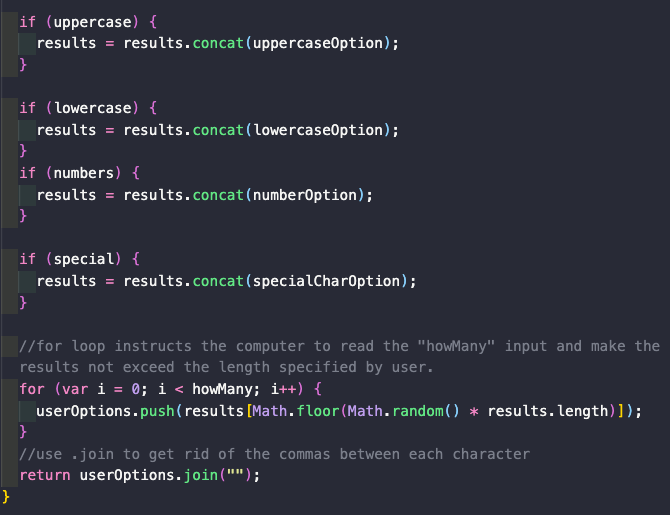

# Password-Generator
03 JavaScript: Password Generator
The task in this project was to build a password generator. The application prompts the user (in the DOM) how many characters they would like their password to be and then proceeds to "confirm" what type of characters make up their password. After a series of questions, a randomly generated password is generated and the user can use "copy to clipboard."

## Links

[Link to the deployed website](https://larafoster.github.io/Password-Generator/)

[Link to the code repository](https://github.com/larafoster/Password-Generator)

### Installation

Upload index.html and assets folder to the deployed webserver.  
The deployed website linked above was deployed using GitHub Pages.

#### Usage

A quick and easy application for generating a random password.

#### Copy to Clipboard bonus
I found this code here
[] (https://developer.mozilla.org/en-US/docs/Mozilla/Add-ons/WebExtensions/Interact_with_the_clipboard/)
Using execCommand()
The document.execCommand() method's "cut" and "copy" commands can be used to replace the clipboard's current contents with the selected material. These commands can be used without any special permission if you are using them in a short-lived event handler for a user action (for example, a click handler).
